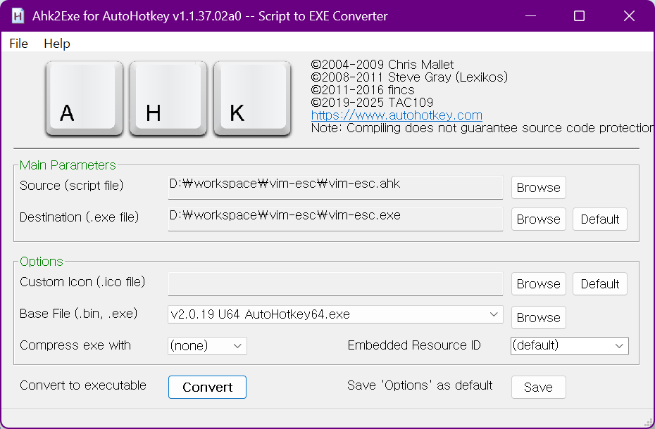

# vim-esc

Windows에서 ESC 키를 누르면 자동으로 영어 입력 상태로 전환하는 AutoHotkey v2 스크립트

## 📋 개요

PyCharm에서 IdeaVim을 사용하거나 Vim 계열 에디터를 사용할 때 자주 발생하는 문제를 해결합니다:
- 한글 주석 작성 후 ESC를 눌러 Normal 모드로 나와도 입력기가 여전히 한글 상태
- Normal 모드에서 명령어 입력 시 한글 상태로 인해 명령어가 제대로 동작하지 않음
- 매번 ESC → 한/영 키를 수동으로 눌러야 하는 번거로움

## ✨ 주요 기능

- **ESC 키 자동 영문 전환**: ESC를 누르면 무조건 영문 모드로 전환
- **스마트 처리**: 
  - 한글 모드 → ESC 시 강제로 영문 모드 전환
  - 영문 모드 → ESC 시 기존 ESC 기능 유지
- **AutoHotkey v2 기반**: 최신 v2 문법 사용으로 64비트 컴파일 지원

## 🚀 설치 및 사용법

### 1. AutoHotkey v2 설치
[AutoHotkey v2 공식 웹사이트](https://www.autohotkey.com/)에서 v2 버전을 다운로드하여 설치하세요.

### 2. 스크립트 실행
1. `vim-esc.ahk` 파일을 다운로드
2. 파일을 더블클릭하여 실행
3. 작업 표시줄에 AutoHotkey 아이콘이 나타나면 실행 완료

### 3. 시작 프로그램 등록 (선택사항)
Windows 부팅 시 자동 실행을 원한다면:
1. `Windows + R` → `shell:startup` 입력
2. `vim-esc.ahk` 파일의 바로가기를 Startup 폴더에 복사

## 💻 코드 구조

```autohotkey
$Esc::
{
    ret := IME_CHECK("A")
    if ret != 0           ; 한글 모드
    {
        IME_SET(0)        ; 강제로 영문 모드로 설정
    }
    else if ret = 0       ; 영문 모드
    {
        Send("{Esc}")     ; 기존 ESC 기능 실행
    }
}
```

### 핵심 함수들

- `IME_CHECK()`: 현재 IME 상태 확인 (0: 영문, 1: 한글)
- `IME_SET()`: IME 상태 강제 설정 (0: 영문, 1: 한글)
- `Send_ImeControl()`: Windows IME API를 통한 IME 제어
- `ImmGetDefaultIMEWnd()`: IME 창 핸들 획득

## 🔧 컴파일 (선택사항)

스크립트를 실행 파일(.exe)로 컴파일하면 AutoHotkey가 설치되지 않은 컴퓨터에서도 사용할 수 있습니다.

### 방법 1: GUI를 통한 컴파일

1. **스크립트 파일 우클릭**
   
   `vim-esc.ahk` 파일을 우클릭하면 "Compile Script" 메뉴가 나타납니다.

2. **컴파일 옵션 설정**
   
   - **Target**: `x64` 선택 (64비트 실행 파일)
   - **Output**: 출력 파일명 설정 (`vim-esc.exe`)
   - **Icon**: 원하는 아이콘 파일 선택 (선택사항)
  

3. **컴파일 실행**
   
   "Compile" 버튼을 클릭하면 같은 폴더에 `.exe` 파일이 생성됩니다.

### 방법 2: 명령줄을 통한 컴파일

```cmd
Ahk2Exe.exe /in vim-esc.ahk /out vim-esc.exe /x64
```

### 컴파일된 실행 파일 사용법

- ✅ AutoHotkey 설치 없이도 실행 가능
- ✅ 다른 컴퓨터에 배포 가능
- ✅ 시작 프로그램에 등록하기 편리
- ✅ 더 빠른 실행 속도

## 📝 변경 이력

### v2.0 (최신)
- AutoHotkey v2 문법으로 전면 개편
- IME 토글 방식에서 강제 설정 방식으로 변경
- 64비트 컴파일 지원
- 더 안정적인 IME 상태 제어

### v1.0
- AutoHotkey v1 기반 초기 버전
- 한/영 키 토글 방식 사용

## 🎯 동작 원리

1. **ESC 키 후킹**: `$Esc::`로 ESC 키 입력을 가로챔
2. **IME 상태 확인**: Windows IME API를 통해 현재 입력 상태 확인
3. **조건부 처리**:
   - 한글 상태: `IME_SET(0)`으로 강제 영문 전환
   - 영문 상태: 원래 ESC 기능 실행
4. **결과**: 항상 ESC 후에는 영문 입력 상태 보장

## 🔍 문제 해결

### 스크립트가 실행되지 않는 경우
- AutoHotkey v2가 올바르게 설치되었는지 확인
- 관리자 권한으로 실행 시도
- Windows Defender나 백신 프로그램에서 차단되지 않았는지 확인

### 일부 프로그램에서 동작하지 않는 경우
- 해당 프로그램이 관리자 권한으로 실행 중인지 확인
- AutoHotkey 스크립트도 관리자 권한으로 실행 필요

## 📄 라이선스

MIT License

## 🤝 기여

버그 리포트나 기능 제안은 Issues를 통해 언제든 환영합니다!
